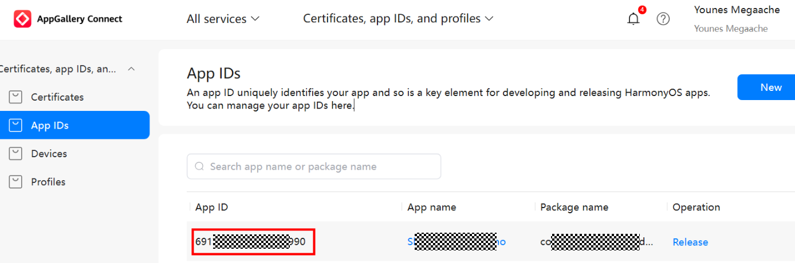
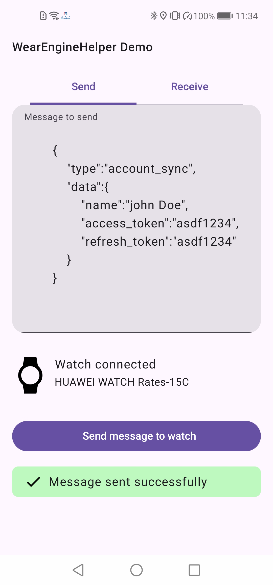
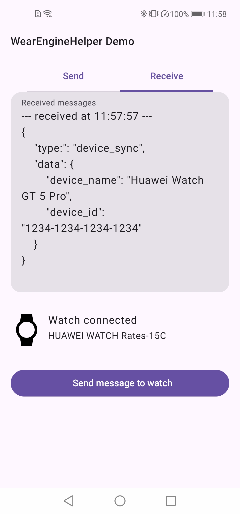

# WearEngineHelper (Android)

A lightweight Kotlin wrapper for Huawei's WearEngine SDK that simplifies communication between Android mobile apps and Huawei watches (HarmonyOS and HarmonyOS Next).

## Features

- Simple API for sending and receiving messages between mobile and watch apps
- Automatic handling of permissions
- Support for both legacy and next-generation Huawei watch devices
- Builder pattern for easy configuration
- Comprehensive error handling
- Coroutine support
- Detailed logging options

> submit a [feature request](https://github.com/megaacheyounes/huawei-wear-engine-helper/issues/new)

## Prerequisites

- Huawei Mobile Services (HMS) Core installed on the device
- Huawei Health app installed on the device
- A Huawei watch paired with the device
- A companion app installed and running on the watch
- Applied for Wear Engine Permission

## Limitations

- Maximum message size is 1KB (1024 bytes)
- Can only send text messages, sending Files will be supported later

## Prerequisite

### Apply for Wear Engine Permission

To maintain compliance with many privacy and data protection laws governing the sensitive and personal information collected by Huawei wearables, you must obtain permission before accessing the Huawei Wear Engine Service.

- Follow the steps in the [official documentation - Applying for the Wear Engine Service](https://developer.huawei.com/consumer/en/doc/connectivity-Guides/applying-wearengine-0000001050777982)

<span style="background-color:red;color:white;">_**without WearEngine permission you can not use or test the SDK**_</span>

## Installation

### 1. Add WearEngineSDK

Follow the steps in the [official documentation - Integrating the Wear Engine SDK](https://developer.huawei.com/consumer/en/doc/connectivity-Guides/integrating-phone-sdk-0000001051137958).

### 2. Add WearEngineHelper

Copy the file `WearEngineHelper.kt` into your project

> for Java implementation, submit a [request](https://github.com/megaacheyounes/huawei-wear-engine-helper/issues/new)

## Usage

### Configuration

Add the following permissions and Huawei health package name in `AndroidManifest.xml`:

```xml
<manifest [...] >

    <uses-permission android:name="android.permission.INTERNET" />
    <uses-permission android:name="android.permission.WRITE_EXTERNAL_STORAGE" />
    <uses-permission android:name="android.permission.ACCESS_NETWORK_STATE" />

    <queries>
        <!-- required for authorization with Huawei Health (Android 11+)   -->
        <package android:name="com.huawei.health" />
    </queries>

    <application [...] >
    [...]
    </application>

</manifest>
```

### Initialization

```kotlin
// Create the helper using the builder pattern
val wearEngineHelper = WearEngineHelper.Builder(context)
    .setWatchPackageName("com.example.watchapp")
    .setWatchFingerprintDebug("WATCH_APP_DEBUG_FINGERPRINT")
    .setWatchFingerprintRelease("WATCH_APP_RELEASE_FINGERPRINT")

    // Optional configurations
    .setPermissions(arrayOf(Permission.DEVICE_MANAGER)) //Wear Engine permission applied for
    .setWatchPackageNameNextGen("com.example.watchapp.nextgen") // For next-gen watches
    .setWatchAppId("WATCH_APP_ID") // For next-gen watches
    .setDebugMode(BuildConfig.DEBUG) // Automatically use debug/release fingerprints
    .setLogTag("MyApp") // Custom log tag
    .enableVerboseLogging(true) // Enable detailed logs
    .build()
```

#### Watch Package Name

The package name is same as `bundleName` which can be found in the `config.json` file of your wearable project.

#### Debug Fingerprint

Obtain this by following the steps in the [official documentation - Obtaining a Signing Certificate Fingerprint on the Wearable Device](https://developer.huawei.com/consumer/en/doc/connectivity-Guides/signature-0000001053969657).

#### Release Fingerprint

Generate this using the same [official documentation - Obtaining a Signing Certificate Fingerprint on the Wearable Device](https://developer.huawei.com/consumer/en/doc/connectivity-Guides/signature-0000001053969657).

#### HarmonyOS Next Package Name

If supporting both legacy HarmonyOS watches and HarmonyOS Next devices, you should create two separate wearable projects with different package names, set the package of the Next version of the app or the legacy package name will be used.

#### HarmonyOS Next App ID

For HarmonyOS Next devices, set the application identifier registered in your AppGallery developer console. This ID remains the same for both debug and release builds



### Check for Connected Watch

```kotlin
// Callback-based approach
wearEngineHelper.hasConnectedWatch { hasWatch ->
    if (hasWatch) {
        // Proceed with watch communication
    } else {
        // Show message to pair a watch
    }
}

// Coroutine-based approach
lifecycleScope.launch {
    val hasWatch = wearEngineHelper.hasConnectedWatchAsync()
    if (hasWatch) {
        // Proceed with watch communication
    } else {
        // Show message to pair a watch
    }
}
```

### Sending Messages to Watch (max 1KB)

```kotlin
wearEngineHelper.sendMessageToWatch(
    data = "Your message data",
    onDeviceConnected = { watchName ->
        Log.d("MyApp", "Connected to watch: $watchName")
    },
    onSuccess = {
        Log.d("MyApp", "Message sent successfully")
    },
    onError = { errorMessage, errorCode ->
        Log.e("MyApp", "Error: $errorMessage (code: $errorCode)")
    }
)
```

### Sending Large Messages to Watch

```kotlin
wearEngineHelper.sendLargeMessageToWatch(
    data = "Your long message data",
    onDeviceConnected = { watchName ->
        Log.d("MyApp", "Connected to watch: $watchName")
    },
    onSuccess = {
        Log.d("MyApp", "Message sent successfully")
    },
    onError = { errorMessage, errorCode ->
        Log.e("MyApp", "Error: $errorMessage (code: $errorCode)")
    }
)
```

### Sending File Messages to Watch (max 100MB)

```kotlin
val file = File(context.filesDir, "data.json")

wearEngineHelper.sendFileToWatch(
    file = file,
    onDeviceConnected = { watchName ->
        Log.d("MyApp", "Connected to watch: $watchName")
    },
    onSuccess = {
        Log.d("MyApp", "File sent successfully")
    },
    onError = { errorMessage, errorCode ->
        Log.e("MyApp", "Error: $errorMessage (code: $errorCode)")
    },
    onProgress = { progress ->
        Log.d("MyApp", "File send progress: $progress")
    }
)
```

### Receiving Messages from Watch

```kotlin
// Register to receive messages
wearEngineHelper.registerReceiver(
    onDeviceConnected = { watchName ->
        Log.d("MyApp", "Connected to watch: $watchName")
    },
    onMessageReceived = { message ->
        Log.d("MyApp", "Received message: $message")
        // Process the message
    },
    onFileReceived = { file ->
        Log.d("MyApp", "Received message: ${file.path}")
        // Process the file
    },
    onError = { errorMessage, errorCode ->
        Log.e("MyApp", "Error: $errorMessage (code: $errorCode)")
    }
)

// Don't forget to unregister when done
override fun onDestroy() {
    super.onDestroy()
    wearEngineHelper.unregisterReceiver()
    wearEngineHelper.release()
}
```

### Error Handling

```kotlin
    private fun handleWearEngineError(errorMessage: String, errorCode: Int) {
        when (errorCode) {
            WearEngineErrorCode.ERROR_CODE_DEVICE_IS_NOT_CONNECTED -> {
                // Prompt user to connect their watch
            }

            WearEngineErrorCode.ERROR_CODE_P2P_WATCH_APP_NOT_EXIT -> {
                // Prompt user to install the watch app
            }

            WearEngineErrorCode.ERROR_CODE_P2P_WATCH_APP_NOT_RUNNING -> {
                // Prompt user to open the watch app
            }

            WearEngineErrorCode.ERROR_CODE_USER_UNAUTHORIZED_IN_HEALTH -> {
                // Explain why permissions are needed, or ask to enable permission manually in Huawei Health app
            }

            WearEngineErrorCode.ERROR_CODE_COMM_FAIL ->{
                // Prompt user to open the watch app and make sure Huawei Health app is running
            }
            //handle other errors
        }
    }
```

### Common Error Codes

| Code | Meaning                                                                                                                                           |
| ---- | ------------------------------------------------------------------------------------------------------------------------------------------------- |
| -1   | Message exceeds 1KB size limitation                                                                                                               |
| 1    | General error (check error message or logs for specifics)                                                                                         |
| 7    | Missing permissions in Huawei Health App                                                                                                          |
| 16   | Watch not detected                                                                                                                                |
| 200  | Watch application not installed                                                                                                                   |
| 201  | Watch application installed but not running                                                                                                       |
| 206  | Sending message to watch failed, could be because watch app is not running, watch got disconnected, or Huawei Health is not running in background |

For the full list of error codes, please refer to the [official documentation - Result Code](https://developer.huawei.com/consumer/en/doc/connectivity-Guides/errocode-0000001054450278).

## Demo project

## Adding to Your Existing Project

1. Copy `MainActivity.kt` and `WearEngineHelper.kt` into your project's source directory
2. Update your `AndroidManifest.xml` to include `MainActivity` as the launcher activity
3. In `MainActivity.kt`, update the `WearEngineHelper` initialization with your app's configuration
4. Rebuild and run your application

## Running as Seperate App

1. Clone the repository:
   ```bash
   git clone https://github.com/megaacheyounes/huawei-wear-engine-helper.git
   ```
2. Open the `example` folder with Android Studio
3. Configure the project:
   - Download and replace `agconnect-services.json` with your own
   - Update the package name in `build.gradle`
   - Configure your signing configuration in `build.gradle`
   - Update the `WearEngineHelper` initialization in `MainActivity.kt`
4. Build and run the sample project

## Screenshots

|               Sending Data to Watch                |               Receiving Data from Watch               |
| :------------------------------------------------: | :---------------------------------------------------: |
|  |  |

## Contributing

Contributions are welcome! Please feel free to submit a Pull Request.

## License

```license
               DO WHAT YOU WANT TO PUBLIC LICENSE

 Copyright (C) 2025 Younes Megaache

 Everyone is permitted to copy and distribute verbatim or modified
 copies of this license document, and changing it is allowed as long
 as the name is changed.

                DO WHAT YOU WANT TO PUBLIC LICENSE
   TERMS AND CONDITIONS FOR COPYING, DISTRIBUTION AND MODIFICATION

  1. You just DO WHAT YOU WANT TO.
```
